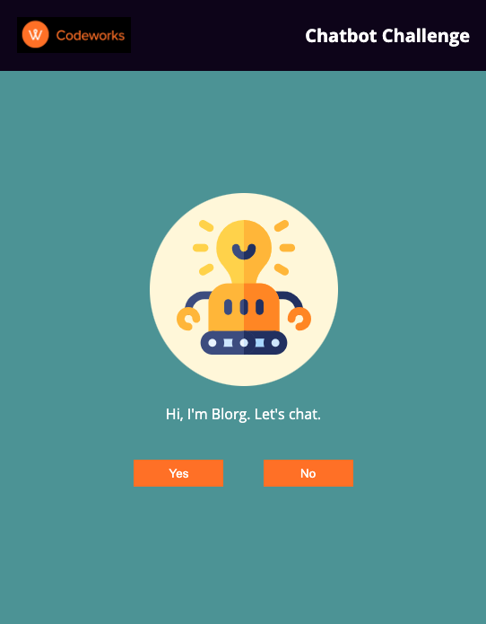
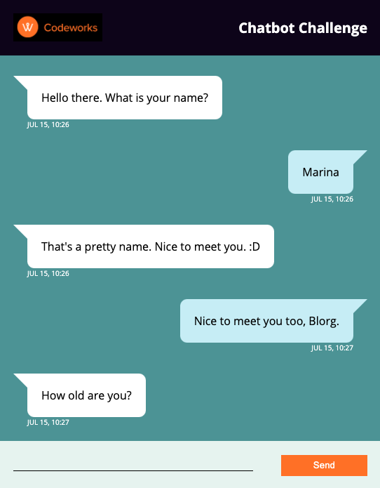

<h1 align="center">Chatbot Codeworks Challenge</h1>

- The Chatbot challenge is the Coding Assessment part of the [Codeworks](https://codeworks.me/berlin/) coding bootcamp application process.
- The goal is to buil a chat application using only HTML, CSS, JavaScript and jQuery with a UI similar to whatsapp. On one side the computer will generate a random conversation, on the other side the user can post messages.

## Overview

- Here you can preview the result:

## Requirements

- [x] Simple chat application built with `HTML`, `CSS`, `JavaScript` and `jQuery`. 
- [x] Single page, that opens in the browser, and shows the messages in colored bubbles. 
- [x] The computer generates a random conversation.
- [x] The user can post messages to answer to the computer.
- [x] The screen automatically flows and follows the messages posted. 
- [x] Each message should have a small indication of the time it was sent.

## How to use it

- Download the files
- Open `index.html` on the browser
- Choose `yes` to chat with the bot
- Answer the bot's questions and press `enter` or click `send` to submit
- Repeat until the chat is over

## Contacts 

  Marina Costa - [@facosta_marina](https://twitter.com/facosta_marina) - facosta.marina@gmail.com

## References and resources

* [jQuery Documentation](https://jquery.com/)
* [MDN Documentation](https://developer.mozilla.org/en-US/)
* [JavaScript Modules with Import/Export Syntax (ES6) - JavaScript Tutorial](https://www.youtube.com/watch?v=s9kNndJLOjg)
* [CSS tricks](https://css-tricks.com/)
* Icon by <a href="https://www.flaticon.com/br/autores/freepik" title="Freepik">Freepik</a> from <a href="https://www.flaticon.com/br/" title="Flaticon"> www.flaticon.com</a>
* [Using node JS as a simple server](https://stackoverflow.com/questions/6084360/using-node-js-as-a-simple-web-server)